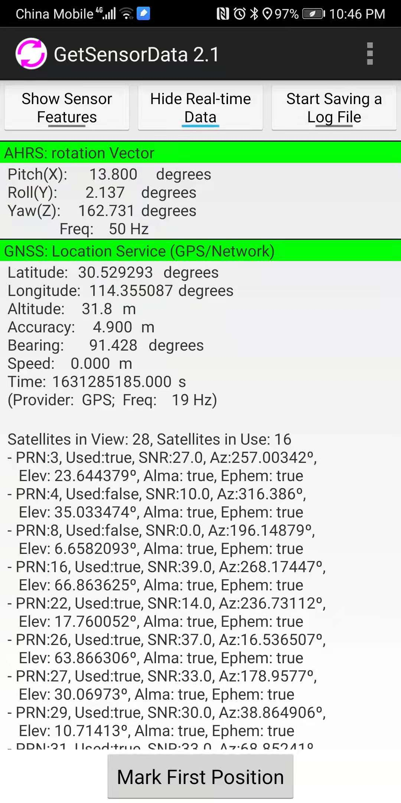

# Get local gravity

## 1. Get lattitude, longitude, and height

### With an advanced GPS receiver

You may setup an antenna with a GPS receiver, and obtain the fix solution for these coordinates.
For a point on the balcony of the LIESMARS third floor, we find the fix solution
```
$GNGGA,025400.00,3031.76063852,N,11421.29486649,E,4,29,0.7,39.4578,M,-13.9067,M,02,3080*65
```
As explained [here](http://aprs.gids.nl/nmea/), the entries mean 
30.52934398 N, 114.3549144 E in WGS84, the orthometric height (height above mean sea level) is 39.5m, 
and the geoid height (mean sea level over WGS84 ellipsoid) is -13.9, 
so the height above ellipsoid (ellipsoidal height over WGS84 ellipsoid) is about 25.55m.

### With an android phone

Alternatively, you may find the latitude, longitude, and 
[ellipsoidal height](https://developer.android.com/reference/android/location/Location#getAltitude()) 
by using say GetSensorData app on an Android phone.

A screenshot taken at the doorway to the LIESMARS lab is .

### With maps
Maps usually only provide latitude and longitude, but not height.
Lattitude and longitude can be shown by right clicking on the [Google map](https://www.google.com/maps/@30.5270658,114.360334,20z).
For instance, LIESMARS 325 Wuhan University is at 30.527194644960165, 114.36038022476181 in WGS84.
You may also use [baidu coordinate picker/坐标拾取器](https://api.map.baidu.com/lbsapi/getpoint/index.html)
But it gives lattitudes and longitudes in a uncanny baidu coordinate system.

Then, assume somehow you know the ellipsoidal height at LIESMARS lab 325 is about 26 m.
The Geoid height at Wuhan University is about -14 m as can be checked from 
[the geoid height calculator](https://www.unavco.org/software/geodetic-utilities/geoid-height-calculator/geoid-height-calculator.html).
Then the orthometric height is about 40 m at lab 325.

## 2. Compute the local gravity

### Use the simple [local gravity calculator](https://www.sensorsone.com/local-gravity-calculator/).
For the above example, 
Input latitude 30.527194644960165, height above sea level 40 meters, leading to local gravity 9.79354 m/s^2.

### Calculate local gravity with EGM2008 by using [the gravity tool in geographiclib](https://geographiclib.sourceforge.io/html/Gravity.1.html).
For the above example, we first install the EGM2008 model following [instructions here](https://geographiclib.sourceforge.io/html/gravity.html).
Then we invoke the Gravity program which uses ellipsoidal height as below.

```
./Gravity -n egm2008 -d /geographiclib-code/gravity --input-string "30.527194644960165 114.36038022476181 26"
```
which gives
```
0.00036 -0.00005 -9.79345
```
